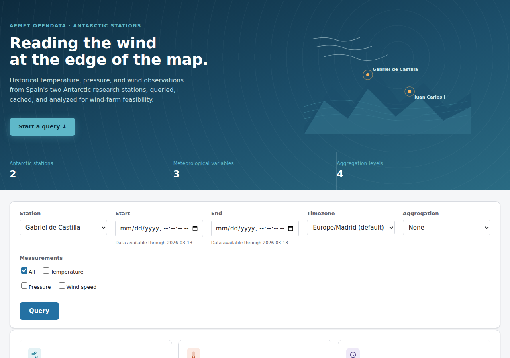
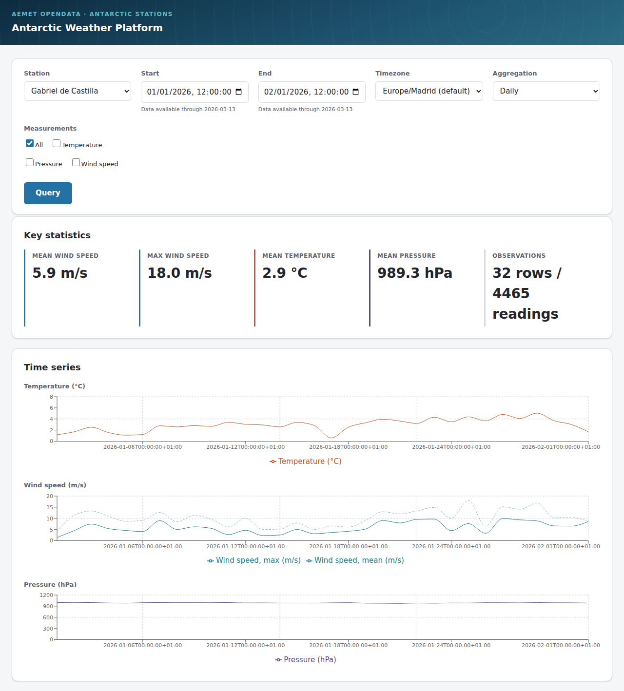
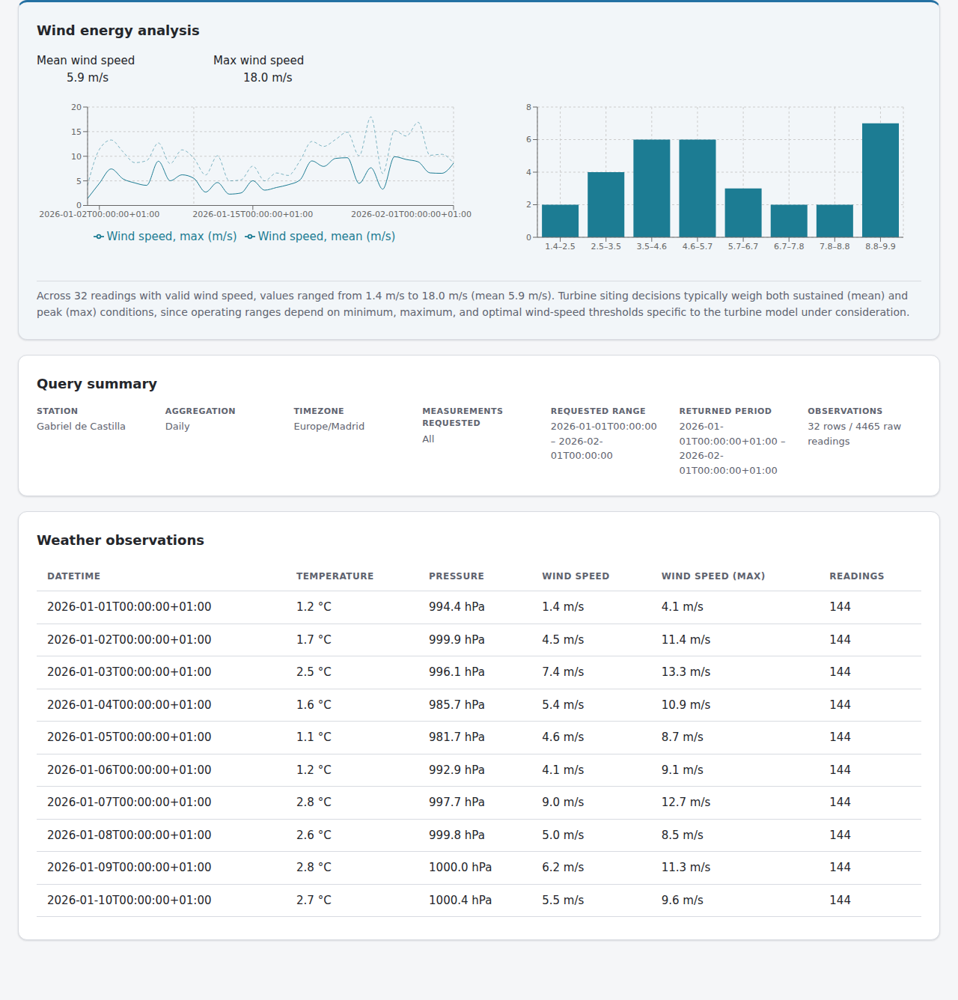

# Antarctic Weather Platform

Full-stack application for retrieving, caching, aggregating, and visualizing
historical Antarctic meteorological observations from AEMET OpenData.

**Status:** in active development. This README reflects what is actually
implemented as of each commit; sections for work not yet started are
omitted rather than stubbed out.

## Business Context

The application supports evaluation of a hypothetical wind-farm project in
Antarctica by making historical weather data from Spain's two Antarctic
research stations queryable, aggregatable, and inspectable through a web
interface: temperature, atmospheric pressure, and wind speed, over
arbitrary date ranges, at hourly/daily/monthly resolution.

## Data Source

Observations come from the AEMET OpenData REST API, specifically:

```
GET /api/antartida/datos/fechaini/{fechaIniStr}/fechafin/{fechaFinStr}/estacion/{identificacion}
```

This endpoint returns raw ~10-minute-interval observations recorded at
Spain's two Antarctic bases. AEMET does not publish this dataset in real
time; observed live, the lag between the most recent available data and
the present has been on the order of several months (not a fixed or
documented figure), so a query with an end date close to today may
legitimately return no data yet.

### Supported stations

| Station | AEMET identifier |
|---|---|
| Gabriel de Castilla (meteorological) | `89070` |
| Juan Carlos I (meteorological) | `89064` |

These identifiers were confirmed against AEMET's official OpenAPI
specification (`https://opendata.aemet.es/AEMET_OpenData_specification.json`)
and verified with live requests. The radiometric station variants
(`89064R`, `89064RA`) exist in AEMET's system but are out of scope for this
application.

## Architecture

Layered backend, framework-independent domain logic:

```
API / Routes            FastAPI routers: request validation, response shaping
       |
Application / Service   Orchestration: cache check -> AEMET fetch -> aggregate
       |
Domain                  Pure functions: timezone conversion, aggregation,
       |                quality filtering (no FastAPI/SQLAlchemy dependency)
       |
Repositories             AEMET client, SQLite repository (independently mockable)
       |
SQLite / AEMET          External systems
```

Domain logic is deliberately kept free of framework dependencies so it can
be unit tested in isolation, particularly the timezone/DST pipeline and
aggregation functions, which are the parts of this system most sensitive to
subtle correctness bugs.

`WeatherService` (`backend/app/services/weather_service.py`) implements the
orchestration layer: check cache coverage, call AEMET only on a miss,
persist the result, then aggregate and return. It depends on its AEMET
client through a `Protocol` (`AemetObservationSource`) rather than the
concrete `AemetClient` class, so tests substitute a fake with no real HTTP
client behind it. This is checked by mypy under strict mode, not just
conventionally true.

### Why layered, not full Domain-Driven Design

This system deliberately borrows DDD's *strategic* boundaries: a domain
layer with no framework dependency, an application/service layer that
orchestrates it, infrastructure (AEMET client, SQLite repository) kept at
the edges and swappable via `Protocol` interfaces, without adopting DDD's
*tactical* patterns: no aggregate roots, no domain events, no repositories
returning rich entities with behavior, no CQRS.

The reason is proportionality, not unfamiliarity with the fuller pattern
set. This system has one real domain concept (a weather observation) and
one meaningful invariant class (timezone/DST correctness, aggregation
correctness). There is no multi-entity consistency boundary, no command
that needs to raise a domain event for another part of the system to react
to, nothing that changes over the object's lifecycle in a way an aggregate
root would need to guard. `ObservationRecord` is a data shape with pure
functions applied to it, not an entity with encapsulated state transitions,
so making it one would add ceremony (a constructor guarding invariants
that don't exist, methods that just set a field) without making anything
safer or easier to test than the current pure-function/dataclass approach
already is.

The concrete benefit taken from DDD without the tactical overhead: strict
layering makes it possible to unit-test timezone conversion and
aggregation, the two places where a subtle bug would be hardest to
notice, with no FastAPI app, no SQLite engine, and no AEMET client in the
picture at all (`backend/tests/unit/test_domain_time.py`,
`test_domain_aggregation.py`). That testability is what the architecture
is actually optimizing for; tactical DDD patterns were left out because
they would cost real complexity here without buying more of it.

## Technology Stack

**Backend:** Python 3.12, FastAPI, Pydantic v2, pydantic-settings,
SQLAlchemy 2.x, SQLite, httpx, pytest, mypy (strict mode), ruff.

`httpx2` (Pydantic's actively maintained continuation of `httpx`, since
Starlette's `TestClient` deprecated the original) is a dev-only dependency
used solely by the test client. The AEMET integration itself uses `httpx`,
per the project's chosen HTTP client, see Assumptions below.

**Frontend:** React 19, TypeScript (strict mode, `noUncheckedIndexedAccess`),
Vite, Recharts, Vitest, React Testing Library, ESLint with
`typescript-eslint`'s `strictTypeChecked` preset. ESLint was chosen over
Vite's newer default scaffold linter (`oxlint`) for reviewer familiarity;
both are legitimate current choices.

## Repository Structure

```
antarctic_weather_platform/
├── backend/
│   ├── app/
│   │   ├── main.py                     # FastAPI app factory, lifespan, health check
│   │   ├── core/
│   │   │   ├── config.py               # environment-driven application settings
│   │   │   ├── logging.py              # root logger configuration
│   │   │   └── exceptions.py           # application exception hierarchy
│   │   ├── domain/
│   │   │   ├── time.py                 # timezone/DST conversion pipeline
│   │   │   └── aggregation.py          # hourly/daily/monthly bucketing
│   │   ├── integrations/
│   │   │   └── aemet/
│   │   │       ├── client.py           # AEMET HTTP client (two-step flow)
│   │   │       └── schemas.py          # transport DTOs + domain mapping
│   │   ├── db/
│   │   │   ├── models.py               # SQLAlchemy schema
│   │   │   ├── session.py              # engine/session lifecycle
│   │   │   └── repository.py           # cache hit/miss, reads, writes
│   │   ├── services/
│   │   │   └── weather_service.py      # cache -> AEMET -> aggregate orchestration
│   │   └── api/
│   │       ├── schemas.py              # request/response wire models
│   │       ├── dependencies.py         # FastAPI dependency injection
│   │       ├── error_handlers.py       # exception -> HTTP status mapping
│   │       └── routes/
│   │           └── observations.py     # GET /observations
│   ├── tests/
│   │   ├── fixtures/                   # real captured AEMET responses
│   │   ├── unit/
│   │   └── integration/                # full app, mocked AEMET HTTP only
│   └── pyproject.toml
├── frontend/
│   ├── src/
│   │   ├── App.tsx                     # state owner, request lifecycle
│   │   ├── types/
│   │   │   ├── api.ts                  # mirrors the backend wire contract
│   │   │   └── requestState.ts         # discriminated union for UI state
│   │   ├── api/
│   │   │   ├── client.ts               # typed fetch wrapper, response parsing
│   │   │   └── client.test.ts
│   │   └── components/
│   │       ├── QueryForm.tsx
│   │       ├── ObservationsTable.tsx
│   │       ├── ObservationsChart.tsx
│   │       └── *.test.tsx
│   └── package.json
├── docs/
│   ├── development-plan.md
│   └── report/                         # LaTeX technical report
└── README.md
```

## Setup

### Backend

Requires Python 3.12+.

```bash
cd backend
python3 -m venv .venv
source .venv/bin/activate
pip install -e ".[dev]"
```

### Environment Variables

Copy `.env.example` to `.env` at the project root and fill in your AEMET
API key. Never commit `.env`, it is already covered by `.gitignore`.

An AEMET OpenData API key is free and self-service:
`https://opendata.aemet.es/centrodedescargas/altaUsuario`.

| Variable | Required | Description |
|---|---|---|
| `AEMET_API_KEY` | yes | Sent as the `api_key` header on every AEMET request |
| `AEMET_BASE_URL` | no | Defaults to `https://opendata.aemet.es/opendata` |
| `AEMET_REQUEST_TIMEOUT_SECONDS` | no | Defaults to `10.0` |
| `DATABASE_PATH` | no | Defaults to `backend/data/weather.db` |
| `LOG_LEVEL` | no | Defaults to `INFO` |
| `CORS_ALLOW_ORIGINS` | no | Defaults to `["http://localhost:5173"]` |

Configuration is validated at startup (`backend/app/core/config.py`): a
missing or invalid required value fails immediately with a clear error
rather than surfacing later inside a request.

### Running tests

```bash
cd backend
pytest
```

## Design Decisions and Assumptions

These are stated here for reference; full reasoning for each is in the
technical report (`docs/report/`, written once the implementation is
complete).

- **Default input timezone.** If the caller omits a timezone, inputs are
  interpreted as `Europe/Madrid`. This matches the fixed output timezone
  (see below), so an unspecified date range corresponds to the same
  calendar day a user would see in the response, rather than shifting by
  the UTC offset.
- **Output timezone.** All returned datetimes are expressed in
  `Europe/Madrid` with an explicit UTC offset, regardless of the input
  timezone supplied. This is a fixed requirement, not a default.
- **Aggregation boundaries.** Hourly/daily/monthly buckets are drawn using
  `Europe/Madrid` calendar boundaries, consistent with the output timezone.
- **Timezone input formats.** Two forms are accepted: an IANA name
  (`Europe/Berlin`), which carries a DST rule and varies by calendar date,
  or a fixed UTC offset (`+02:00`, `-05:30`), which carries no DST logic
  at all; it is that many hours from UTC on every date supplied. A
  caller using the offset form is opting out of DST reasoning explicitly;
  the two are not interchangeable representations of the same thing.
- **Timezone selector.** The frontend offers a dropdown of common
  timezones, defaulting to `Europe/Madrid` (the backend's own default),
  plus an "Other" option that reveals a free-text field so any IANA name
  or fixed offset the backend accepts remains reachable, not just the
  curated list. No IP-based geolocation or server-side location tracking
  is performed anywhere in this system.
- **Data quality filtering.** AEMET flags each observation with `qdato`
  (0 = good, 1 = bad quality), a field discovered during live API
  verification rather than specified in the original requirements. A
  measurement value is never surfaced as trustworthy anywhere in the API
  if its `qdato = 1`: the underlying observation is retained in SQLite
  (the cache is a faithful copy of what AEMET sent), but both aggregated
  (hourly/daily/monthly) results and unaggregated ("None" aggregation)
  responses report `null` for that measurement rather than the flagged
  value.
- **Missing-value sentinel.** AEMET represents inapplicable/missing fields
  as the literal string `"NaN"` rather than JSON `null` or an omitted key.
  This is handled explicitly before type coercion in the AEMET response
  mapping layer.

## Timezone and DST Handling

`backend/app/domain/time.py` isolates all timezone conversion from the
AEMET client, persistence, and API layers. It distinguishes:

- a **naive wall-clock value** (what a user types, meaningless without a
  timezone),
- a **named timezone** (`zoneinfo.ZoneInfo`, an IANA DST rule set, not a
  fixed offset),
- the **UTC instant** that pair resolves to, and
- the **Europe/Madrid output representation** of that instant.

Two DST hazards are handled explicitly rather than left to Python's
defaults:

- **Nonexistent local times** (the hour skipped during a spring-forward
  transition, e.g. `2026-03-29T02:30:00` never occurs in Europe/Madrid)
  raise `NonexistentLocalTimeError` rather than silently resolving to
  whatever offset Python's `fold` default happens to produce.
- **Ambiguous local times** (the hour repeated during a fall-back
  transition, e.g. `2026-10-25T02:30:00` occurs twice, at `+02:00` and
  again at `+01:00`) resolve deterministically to the first (pre-
  transition) occurrence, as a documented convention rather than an
  implicit default.

Both transition dates were verified empirically against Python's own
`zoneinfo` (IANA tz database) for 2026, not assumed, and both are covered
by tests anchored to those exact dates.

## Aggregation Strategy

`backend/app/domain/aggregation.py` groups observations into calendar
buckets using their **Europe/Madrid** local representation, not their raw
UTC timestamp. A daily or monthly boundary drawn in UTC would split
observations that belong to the same Madrid calendar day whenever Madrid's
UTC offset is nonzero, which is always, since Madrid is never UTC+0. This
is tested directly: two observations 1 hour apart in UTC, straddling
midnight Madrid time, land in different daily buckets; the same test
repeated across the March 2026 DST transition confirms the bucket key is
computed from the local calendar date, not from a fixed-offset UTC split.

Each measurement's bucket value is the arithmetic mean of that bucket's
good-quality (`qdato = 0`), non-missing readings:

```
x̄ = (1/n) · Σ xᵢ,  i = 1..n
```

The mean is a reasonable summary of a continuous physical quantity
(temperature, pressure, wind speed) sampled at roughly regular ~10-minute
intervals: it is the standard estimator of a signal's typical value over
an interval. It is explicitly **not** a complete summary on its own:
averaging wind speed discards gust information (a bucket with one strong
gust and mostly calm air can share a mean with a bucket of steady moderate
wind). This matters concretely, not just statistically: turbine power
generation has minimum, maximum, and optimal operating wind-speed
thresholds, confirmed with the assigning team, so a mean alone can conceal
a gust or lull that is operationally significant for a wind-farm
feasibility study. Wind speed's aggregated result therefore reports both
the mean and the maximum of the bucket's valid readings
(`wind_speed_ms`, `wind_speed_max_ms`); temperature and pressure report
the mean only, since the same operational-threshold reasoning does not
apply to them here. Wind direction is still not modeled at all, since it
falls outside the specification's three required measurements. A bucket
where every reading is missing or quality-flagged reports `null` for that
measurement, not `0.0`. Zero would be a real, incorrect physical value,
whereas `null` correctly means "no valid data."

Grouping and reduction are both O(n) in the number of raw observations,
which is the relevant complexity for a client-facing query over a
bounded date range at ~10-minute granularity (at most a few thousand
points).

Buckets are only produced for calendar periods that contain at least one
raw observation. A gap in AEMET's data (a missing hour, or a station
outage) produces no row for that period, rather than a null-filled
placeholder row. This keeps the aggregation function's contract simple
(it only needs the observations, not the originally requested range) and
avoids fabricating rows the source data never touched; a chart consuming
this data should not assume a continuous, gap-free time axis.

## Database and Cache Strategy

Two SQLite tables (`backend/app/db/models.py`), each with a purpose
derived from what actually needs to be tracked:

**`observations`**: the identity of a meteorological observation is
`(station, observed_at)`: the same station measuring at the same instant
is the same observation by definition. This is enforced as a real database
constraint (`UNIQUE(station, observed_at)`), not just an application-level
convention, so a bug in the caching logic would surface as an integrity
error rather than silently duplicating rows. The same composite also
serves as the lookup index, since every real query is "observations for
station X between times A and B."

**`fetched_ranges`**: records that AEMET was queried for a given
`(station, range)`, independent of whether that query returned any
observations. This is necessary because AEMET publishes this dataset with
a real lag behind the present: a recent date range legitimately has zero
observations, and without a separate record of "we asked and got
nothing," that would be indistinguishable from "we never asked," causing
the cache to re-query AEMET on every request for that range.

**Cache hit logic**, following interval reasoning: for a requested range
*R* on a given station, the cache is checked against previously fetched
ranges *C*. The current implementation checks whether *R* is fully
contained within a single prior fetched range, not a general union of
multiple overlapping fetched ranges (*R \\ C* as a true set difference
across many stored intervals). A request spanning two previously fetched
but non-adjacent ranges is treated as a miss and the full range is
refetched. This is a deliberate scope decision: single-range containment
covers the actual usage pattern (a user submitting and refining one query)
without the complexity of interval-tree merging, which correctness and
explainability don't require here.

This check runs per ≤31-day chunk, not once against the whole requested
range (see AEMET Integration Notes below for why chunking exists at all).
In practice this makes the cache finer-grained than a naive reading of
"single-range containment" suggests: a year-long request that was
previously fetched a month at a time is checked, and can hit, one
month-sized chunk at a time, not as one large range.

Sessions are scoped with a context manager (`session_scope`) that commits
on success and rolls back on any exception, so a partially-applied write
is never left in the database.

**Cache staleness.** A fetched range is cached indefinitely; there is no
TTL or revalidation policy. This was confirmed as correct, not merely
assumed, by the assigning team: AEMET's historical Antarctic data is
stable once published and does not change retroactively.

Two SQLite-specific correctness issues surfaced during testing and are
worth recording, since both would have been silent data bugs rather than
crashes:

- SQLite's `DATETIME` column has no timezone concept, so SQLAlchemy
  silently returns naive `datetime` objects on read even when an
  aware value was written. A round-trip test caught this
  (`observed_at` came back missing `tzinfo`). `UTCDateTime`, a small
  `TypeDecorator`, re-attaches UTC on load; every datetime this
  application persists is UTC by construction, so this is a correctness
  fix, not an assumption of convenience.
- `Session.merge()` upserts on the ORM primary key, not on any other
  unique constraint. An idempotency test caught that re-fetching an
  overlapping range raised `IntegrityError` instead of updating the
  existing row, because every freshly constructed `ObservationRecord` has
  no primary key set and so was always treated as an insert. The fix uses
  an explicit `INSERT ... ON CONFLICT (station, observed_at) DO UPDATE`,
  which targets the actual business key.

**Production evolution path** (not implemented, since nothing here
requires it yet): PostgreSQL in place of SQLite for concurrent write
access, Alembic for schema migrations once the schema has a real change
history, a background worker performing scheduled ingestion instead of
fetching on request, and Redis as a hot-path cache in front of the
database if query volume ever justified it.

## AEMET Integration Notes

- The client performs at most one retry for connection/timeout failures
  and 5xx responses, with a short fixed delay (not exponential backoff:
  this is a single-user local application, not a system under concurrent
  load). Other 4xx responses are never retried: retrying a client error
  would fail identically.
- A 429 (rate limit) is retried up to three times, with the cooldown
  doubling after each consecutive 429 (5s, 10s, 20s by default), rather
  than failing the request outright. This matters specifically because
  `WeatherService` splits any range over ~31 days into several sequential
  AEMET calls (see below): a wide query can issue dozens of requests in a
  row, and confirmed live, sustained sequential traffic can trip AEMET's
  limiter more than once in a row, not just transiently: a single retry
  was not enough in practice. A persistent 429 (i.e. still rate-limited
  after all retries) still raises `AemetUnavailableError` rather than
  retrying indefinitely.
- 401/403 (bad or missing API key) raises `AemetAuthenticationError`, kept
  distinct from `AemetUnavailableError`, since a rejected key is a
  configuration problem, not a transient outage: conflating the two would
  make "should I retry?" logic upstream give the wrong answer.
- AEMET's 404 for an empty date range is treated as a successful empty
  result (`[]`), not an exception, consistent with the publication lag
  noted above.
- The `datos` URL returned in step one is a pre-signed link and does not
  take the `api_key` header, verified against the live API, not assumed.
- AEMET signals "no data for this range" in two different ways, both
  discovered by live testing rather than documentation: a genuine HTTP
  404, and an HTTP 200 whose body carries `estado: 404` with no
  `datos`/`metadatos` fields. The client checks for the embedded code
  before attempting to validate the envelope's full shape, so this is
  never mistaken for a malformed response.
- **AEMET rejects any single request spanning more than ~31 days**
  (`"El rango de fechas no puede ser superior a 1 mes"`), an undocumented
  limit found only by querying a full year and getting far fewer
  observations back than expected, silently, using the same
  `estado: 404` wrapper as a genuine empty result. The two cases are now
  distinguished by the response text (`AemetRangeTooLongError` vs. a
  legitimate empty list), and `WeatherService` proactively splits any
  requested range into ≤31-day chunks before ever calling AEMET, checking
  the cache per chunk rather than for the whole range, so a later
  request overlapping only part of a previously-fetched year still
  benefits from a partial cache hit instead of forcing a full re-fetch.

**Rate limiting.** AEMET does not publish a rate limit, and the assigning
team explicitly flagged this as something to handle conservatively. The
client therefore throttles proactively rather than relying only on
reacting to a `429`: every outbound request passes through a single
choke point that enforces a minimum 500ms spacing from the previous
request, guarded by an `asyncio.Lock` so concurrent callers cannot both
observe "enough time has passed" and fire together. A real `429` response
extends that spacing to a 5 second cooldown, since a real `429` is direct
evidence of the actual limit and is worth more than the conservative
default guess. This lives inside `AemetClient` rather than as a
general-purpose rate-limiter component, since there is exactly one
external API and one caller of it; a reusable abstraction would be
unjustified complexity here.

## Backend API

### `GET /observations`

| Query parameter | Required | Notes |
|---|---|---|
| `station` | yes | `gabriel_de_castilla` or `juan_carlos_i` |
| `start` | yes | `YYYY-MM-DDTHH:MM:SS`, local to `timezone` (no UTC offset accepted) |
| `end` | yes | Same format; must be after `start` |
| `timezone` | no | IANA name (`Europe/Berlin`) or fixed UTC offset (`+02:00`, `-05:30`); defaults to `Europe/Madrid` if omitted |
| `aggregation` | no | `none` (default), `hourly`, `daily`, or `monthly` |
| `measurement` | no | Repeat to select multiple (`temperature`, `pressure`, `speed`); omit entirely to receive all three |

Response is a JSON array; each element's `datetime` is Europe/Madrid with
an explicit UTC offset, and any measurement not requested is `null` rather
than omitted, keeping the response shape uniform regardless of selection.
When `speed` is requested, the response includes both `wind_speed_ms`
(mean) and `wind_speed_max_ms` (maximum) for the bucket, since a mean
alone can conceal a gust or lull relevant to turbine operation (see
Aggregation Strategy below); `wind_speed_max_ms` is not itself a
separately selectable measurement.

Validation failures (unknown station, `start >= end`, malformed datetime,
an offset-bearing datetime where none is accepted, an unrecognized
timezone name) return `400` with a message describing the problem.
Failures in FastAPI's own request-shape validation (a missing required
parameter, for instance) return `422`, distinct from this application's
own domain validation. Upstream/persistence failures return `502` or
`500`, see Error Handling below.

### `GET /observations/latest-available`

Query params: `station` (required, same values as above). Returns
`{"latest_available_date": "YYYY-MM-DD" | null}`, the most recent date
AEMET is confirmed to have data for, driving the frontend's date-picker
cap. Answered cache-first: `MAX(observed_at)` already in the local SQLite
cache (free and instant, and since the cache is populated entirely by
successful AEMET fetches, it is already the most authoritative record this
app has of "what data have we actually confirmed exists"). A live AEMET
probe (stepping back through 60-day windows, bounded to 6 attempts) only
runs as a cold-start fallback when nothing is cached yet for that
station. The endpoint's own answer is cached in-process for 1 hour per
station, since the true value changes at most roughly monthly and this
endpoint may be called on every page load.

### `GET /health`

Returns `{"status": "ok"}`. A smoke test that the app booted (settings
loaded, database schema created) without requiring a real AEMET call.

### Error Handling

A single exception handler (`backend/app/api/error_handlers.py`) maps
the application's exception hierarchy to HTTP status codes in one place,
rather than scattering `try`/`except` across routes:

| Exception | Status | Reasoning |
|---|---|---|
| `ValidationError` and subclasses | 400 | Caller-supplied input is invalid |
| `AemetAuthenticationError` | 500 | Server misconfiguration (bad AEMET key), not the caller's fault |
| `AemetError` (other subclasses) | 502 | This service is a proxy to AEMET; an upstream failure is a bad-gateway condition |
| `PersistenceError` | 500 | Local database failure |
| Anything else | 500 | Unexpected, logged in full server-side |

For any `5xx` response, the response body is a generic message; the real
exception detail (which may name an internal table, config variable, or
upstream URL) is logged server-side only, never returned to the caller.

### Connection Reuse

The `httpx.AsyncClient` used for AEMET requests and the SQLite engine are
both constructed once, in a FastAPI `lifespan` context manager, and
reused across every request via `app.state`, not rebuilt per request.
Rebuilding the HTTP client per request would mean paying a new TCP+TLS
handshake to AEMET on every call instead of reusing a pooled connection,
which is the concrete mechanism behind "connection reuse" as a resilience
property, not just a phrase.

## Frontend

React 19 + TypeScript (Vite), in `frontend/`. A single query form
(`QueryForm`) captures every backend parameter: station, start/end
datetime, timezone, aggregation, measurement selection, and submits to
`GET /observations` through a typed API client (`api/client.ts`). Both
date fields are capped at the most recent date AEMET is confirmed to have
data for (`GET /observations/latest-available`, cache-first with a
live-probe fallback, see the backend endpoint docs above), with a caption
stating the date, so a query that's doomed to return nothing is caught
before submission rather than after. The timezone field is a dropdown of
common zones defaulting to `Europe/Madrid` (the backend's own default),
with an "Other" option that reveals a free-text field so any IANA name or
fixed UTC offset the backend accepts stays reachable, not just the
curated list.

Before any query, the page shows a full-bleed polar-themed hero (`Hero`):
a headline and call to action beside an abstract, entirely vector
illustration of the Antarctic coastline with the two stations marked,
followed by three short cards explaining what each measurement offers and
a compact diagram of the data pipeline (`IntroFeatures`), rather than a
blank box:



Once a query is submitted, the full hero and intro cards are replaced by
a compact header (`CompactHeader`) carrying the same identity in a slim
strip, so the page never goes headless while the analytical workspace
takes over. A successful query renders, in order of analytical weight: a
KPI strip (`SummaryMetrics`: mean/max wind speed, mean temperature, mean
pressure, observation count, each with its rationale in a `title`
tooltip and a color-coded left rail matching its measurement family),
then the main time series, then a visually distinct wind-energy analysis
section, then a compact query-metadata strip, then the full table:



Every measurement has one consistent color identity across the whole
frontend: wind speed in cyan/teal, temperature in warm orange-red,
pressure in indigo/violet, applied to chart lines, KPI card rails,
measurement-checkbox swatches, and legends alike. Color is never the only
signal; every colored element also carries a text label.

The time series (`ObservationsChart`) is three vertically-stacked,
single-axis panels: temperature, wind speed (mean and max), pressure,
synced via Recharts' `syncId` so hovering any one shows a shared
crosshair across all three. This replaced an earlier dual-axis design:
plotting unrelated units (°C, m/s, hPa) against two shared axes made it
look as though their line shapes were comparable, which was an artifact
of arbitrary axis scaling, not a real relationship in the data. Lines do
not connect across `null` values, since a gap (a bucket with no valid
readings, or a measurement not requested) is a real absence, not an
interpolation opportunity.

The wind-energy section (`WindEnergyView`) is the frontend's analytical
signature, tied directly to feedback from the assigning team that turbine
operation depends on minimum, maximum, and optimal wind-speed thresholds,
not the mean alone: a mean/max summary, a reused wind time series, and a
histogram of the wind-speed distribution (bucketed client-side from the
same response data). A single mean can conceal whether conditions are
consistently moderate or swing between calm and extreme, which matters
directly for feasibility. The section deliberately never prints a
specific turbine threshold (cut-in/rated/cut-out speed); those are
turbine-model-specific and not part of this API or the challenge. A
regression test asserts that text never appears.



Application state is one discriminated union
(`{status: 'idle' | 'loading' | 'success' | 'error', ...}`) rather than
several independent booleans, so invalid combinations (loading and error
simultaneously, for instance) are unrepresentable rather than merely
avoided by convention. Every state the challenge specifies (initial,
loading, success, empty, validation, and API error) is handled
explicitly in `App.tsx`.

## Testing

**Backend** (`backend/tests/`, pytest): unit tests for each domain module
in isolation (timezone/DST, aggregation, exception hierarchy) plus the
AEMET client and cache repository with all external calls mocked, and
integration tests exercising the full FastAPI app end-to-end (mocked AEMET
HTTP only) across every validation and behavioral case in the
specification. Run with `pytest` from `backend/`.

**Frontend** (`frontend/src/**/*.test.tsx`, Vitest + React Testing
Library): behavioral tests from the user's perspective, form validation
(required fields, start-before-end), successful submission, loading
state, API error state, empty state, table rendering (including the
`null`-vs-real-zero distinction), and interactions changing the
submitted query (aggregation level, station, measurement selection). The
API layer is mocked at `getObservations`, not at `fetch`, since the API
client itself already has its own dedicated test suite covering request
construction, response parsing, and error handling. Run with `npm test`
from `frontend/`.

Both suites mock every external call (AEMET, the backend API) and never
depend on network access or a running counterpart service to pass.

## Continuous Integration

Two GitHub Actions workflows (`.github/workflows/backend.yml`,
`frontend.yml`) run automatically on every push and pull request touching
their respective directory, scoped by a `paths` filter so a frontend-only
change doesn't trigger the backend job and vice versa. Backend: `ruff
check`, `mypy` (strict), then `pytest`. Frontend: `npm ci`, `eslint`,
`vitest run`, then `npm run build` (which itself runs `tsc -b`, covering
the type check without a separate step). Neither workflow currently gates
merges via branch protection; that's tracked as the next step in the
technical report's Future Improvements section.

These workflows were added late in development, not from the first
commit. This is stated plainly rather than left for a reviewer to notice
from the commit history: what existed from early on was the same checks
run manually and consistently, every backend change verified against
`pytest`, `mypy`, and `ruff`, every frontend change against `vitest`,
`tsc`, and `eslint`, before being considered complete, which is why the
test and type-check results referenced throughout this README and the
technical report were never contingent on CI existing. Automating that
existing discipline into a pipeline that runs on every push, rather than
only when the developer remembers to run it, was a later, deliberate
addition, not a foundation the rest of the project's quality depended on.

## Trade-offs

- **httpx vs. httpx2.** `httpx` has had no release since December 2024,
  and its maintainers have begun stewarding `httpx2` as its continuation
  (used internally by Starlette's own `TestClient` as of the current
  version). We chose to keep `httpx` for the actual AEMET client, since it
  shows no deprecation notice on its own PyPI listing and is what this
  project's requirements specify; `httpx2` is used only as a dev
  dependency, to satisfy `TestClient`. This trades a small amount of
  forward-risk (building on a library with a long release gap) for
  avoiding an unverified migration onto a very recently released
  successor package under real project time constraints.

## Assumptions Requiring Future Verification

- Field availability differs between station types (confirmed: Juan Carlos
  I's live response included `radKjM2`, `rec`, `tsb`, and `altNieve` fields
  that Gabriel de Castilla's did not). The AEMET response mapping treats
  every field outside the five required ones as optional, but this has
  only been verified against these two specific stations.

## AI-Assisted Development Disclosure

AI-assisted tools were used as an engineering accelerator for design exploration, implementation support, code review, documentation, and test-case ideation.

All architectural decisions, trade-offs, verification of AEMET API behavior, and final validation of the submitted solution were reviewed and owned by the developer.
